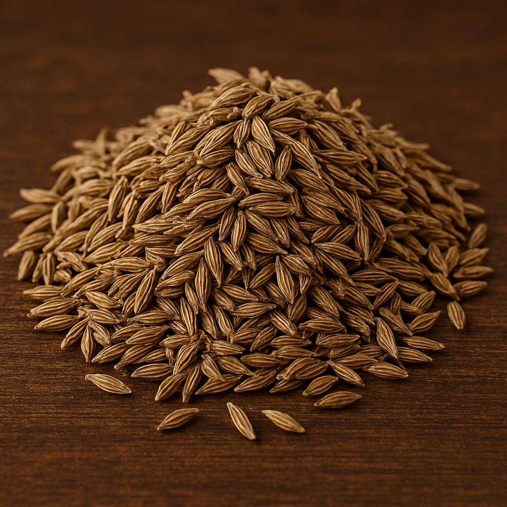

# 🚀 COMPREHENSIVE SEO STRATEGY FOR MILE OVERSEAS

## Spice Export Website Optimization Plan

---

## **2. 🔧 TECHNICAL SEO ENHANCEMENTS**

### **Critical Technical Improvements**

#### **A. Site Speed Optimization**

```html
<!-- Add to <head> section for better performance -->
<link rel="preload" href="css/style.css" as="style" />
<link rel="preload" href="images/logo-modern.png" as="image" />
<link
  rel="preload"
  href="https://fonts.googleapis.com/css2?family=Nunito+Sans:wght@400;600;700&display=swap"
  as="style"
/>

<!-- Optimize images with WebP format -->
<picture>
  <source srcset="images/cumin-seeds.webp" type="image/webp" />
  
</picture>
```

#### **B. Enhanced Structured Data Implementation**

```json
// FAQ Schema for better SERP features
{
  "@context": "https://schema.org",
  "@type": "FAQPage",
  "mainEntity": [
    {
      "@type": "Question",
      "name": "What is the minimum order quantity for spice exports to UAE?",
      "acceptedAnswer": {
        "@type": "Answer",
        "text": "Our minimum order quantity for UAE exports is typically one 20ft container (14 MT for cumin seeds, 16 MT for turmeric powder). We also offer 40ft containers for larger orders."
      }
    },
    {
      "@type": "Question",
      "name": "How long does shipping take from India to Dubai?",
      "acceptedAnswer": {
        "@type": "Answer",
        "text": "Shipping from Indian ports to Dubai typically takes 15-20 days. We provide real-time tracking and updates throughout the journey."
      }
    }
  ]
}
```

#### **C. Mobile Optimization Checklist**

- ✅ Implement touch-friendly navigation (44px minimum touch targets)
- ✅ Optimize hero video for mobile (reduce file size, add poster image)
- ✅ Test Core Web Vitals scores (aim for LCP < 2.5s, FID < 100ms, CLS < 0.1)
- ✅ Add mobile-specific CTAs and contact options

#### **D. URL Structure Improvements**

```
Current: /product-details.html?id=1
Improved: /products/cumin-seeds/
Improved: /products/turmeric-powder/
Improved: /markets/uae/
Improved: /markets/saudi-arabia/
```

---

## **3. 📝 CONTENT STRATEGY FOR B2B SPICE EXPORTS**

### **Content Pillars for International Markets**

#### **Pillar 1: Market-Specific Content (40% of content)**

- UAE Import Guide
- Saudi Arabia Halal Requirements
- Qatar Market Opportunities
- Kuwait Bulk Purchasing
- Oman Organic Demand
- Bahrain Restaurant Supply

#### **Pillar 2: Product Education (30% of content)**

- Spice Quality Standards
- Seasonal Availability Guides
- Processing & Packaging Options
- Organic vs Conventional Comparison
- Grade Classifications (Singapore, European, Bold)

#### **Pillar 3: Industry Insights (20% of content)**

- Pricing Trends & Forecasts
- Harvest Reports
- Export Regulations Updates
- Market Analysis Reports
- Container Optimization Tips

#### **Pillar 4: Company Authority (10% of content)**

- Case Studies & Success Stories
- Certification Updates
- Facility Tours
- Quality Process Documentation
- Customer Testimonials

### **Content Calendar - Q1 2024**

#### **January 2024**

1. "Complete Guide to Importing Spices from India to UAE"
2. "2024 Cumin Market Forecast: Price Trends for GCC Importers"
3. "How to Choose Between Organic and Conventional Spices"
4. "Case Study: Supplying 500 MT Turmeric to Dubai Restaurant Chain"

#### **February 2024**

1. "Saudi Arabia Spice Import Requirements: Updated 2024 Guide"
2. "Top 10 Indian Spices in Demand in Qatar Market"
3. "Container Loading Optimization for Bulk Spice Exports"
4. "Understanding HACCP Standards for Spice Imports"

#### **March 2024**

1. "Turmeric Harvest Season 2024: Quality and Availability Update"
2. "Kuwait Spice Market Analysis: Opportunities for Indian Exporters"
3. "Chili Processing: From Farm to Export Quality"
4. "Customer Success: 3-Year Partnership with Abu Dhabi Distributor"

### **Keyword Clusters for Content**

#### **Cluster 1: UAE Market (Primary)**

- Core: "spice import UAE", "Dubai spice supplier"
- Long-tail: "import cumin seeds from India to UAE", "bulk turmeric supplier Dubai"
- Location: "Dubai", "Abu Dhabi", "Sharjah", "Ajman"

#### **Cluster 2: Saudi Arabia Market**

- Core: "Saudi Arabia spice import", "halal spice supplier KSA"
- Long-tail: "export spices to Saudi Arabia from India", "Riyadh bulk spice distributor"
- Location: "Riyadh", "Jeddah", "Dammam", "Mecca"

#### **Cluster 3: Quality & Standards**

- Core: "export quality spices", "premium spice supplier"
- Long-tail: "organic spice certification India", "HACCP certified spice exporter"
- Technical: "Singapore quality", "European grade", "sortex cleaned"

---

## **4. 🔗 BACKLINK & AUTHORITY BUILDING STRATEGY**

### **High-Priority Link Building Targets**

#### **A. Industry Directories & Trade Platforms**

1. **TradeIndia.com** - Premium listing with detailed company profile
2. **Alibaba.com** - Gold supplier membership with verified credentials
3. **IndiaMART** - Featured listing in spices category
4. **ExportImport.in** - Comprehensive exporter profile
5. **IndiaBizClub.com** - B2B directory with industry focus

#### **B. Government & Trade Association Websites**

1. **FIEO (Federation of Indian Export Organisations)** - Member directory listing
2. **Spices Board India** - Registered exporter listing
3. **APEDA (Agricultural & Processed Food Products Export Development Authority)**
4. **CII (Confederation of Indian Industry)** - Member profile
5. **India Trade Portal** - Government export directory

#### **C. Industry Publications & News Sites**

1. **SpiceGuide.net** - Industry news and company features
2. **FoodNavigator-Asia.com** - Press releases and expert quotes
3. **AgriProFocus** - B2B agricultural platform
4. **Fresh Plaza** - International trade news
5. **World Spice Organisation** - Industry insights and company mentions

#### **D. Regional Chamber of Commerce**

1. **UAE-India Business Council** - Member directory
2. **Saudi-India Business Council** - Trade facilitation listings
3. **Qatar Chamber of Commerce** - International business directory
4. **Dubai Chamber of Commerce** - Supplier database
5. **India Business Center, Riyadh** - Member listings

### **Link Building Tactics**

#### **1. Guest Posting Strategy**

- Target: Industry blogs, trade publications, regional business magazines
- Topics: Market insights, quality standards, trade regulations
- Goal: 2-3 guest posts per month with natural link inclusion

#### **2. Digital PR Campaign**

- Press releases for new certifications, major contracts, facility expansions
- Expert commentary on spice market trends, pricing, seasonal factors
- Industry award submissions and recognition programs

#### **3. Partnership Link Exchange**

- Freight forwarders and logistics companies
- Quality testing laboratories
- Packaging suppliers
- Agricultural equipment manufacturers

#### **4. Resource Page Link Building**

- Create comprehensive guides (spice import guides, quality standards)
- Offer as free resources to industry websites
- Target "resources" and "links" pages of relevant websites

---

## **5. 📱 SOCIAL MEDIA & BRANDING INTEGRATION**

### **LinkedIn Strategy (Primary B2B Platform)**

#### **Company Page Optimization**

- **Bio**: "Leading Indian spice exporter serving UAE, Saudi Arabia & GCC markets. Premium quality cumin, turmeric, chili in bulk. ISO certified. 15+ years experience."
- **Cover Image**: High-quality spice montage with "GCC's Trusted Spice Partner" messaging
- **Content Pillars**:
  - Industry insights and market trends (40%)
  - Product spotlights and quality showcases (30%)
  - Customer success stories and testimonials (20%)
  - Behind-the-scenes content (facility, team, processes) (10%)

#### **LinkedIn Content Calendar**

**Monday**: Market Monday - Industry insights, pricing trends, market analysis
**Wednesday**: Quality Wednesday - Product features, certifications, testing processes  
**Friday**: Feature Friday - Customer stories, case studies, success stories

#### **LinkedIn Advertising Strategy**

- **Target Audience**: Spice importers, food industry buyers, restaurant chains in UAE/GCC
- **Job Titles**: Import Manager, Procurement Head, Food & Beverage Manager
- **Companies**: Food distributors, restaurant chains, spice trading companies
- **Locations**: UAE, Saudi Arabia, Qatar, Kuwait, Bahrain, Oman

### **Instagram Strategy (Visual Storytelling)**

#### **Content Types**

1. **Product Photography**: High-quality spice images, harvest scenes, facility tours
2. **Process Videos**: Sortex cleaning, quality testing, packaging processes
3. **Educational Content**: Spice origins, uses, quality parameters
4. **Behind-the-Scenes**: Team, facility, day-in-the-life content

#### **Hashtag Strategy**

**Primary**: #SpiceExporter #IndianSpices #UAEImport #GCCSpices #QualitySpices
**Secondary**: #CuminSeeds #TurmericPowder #ChiliExport #OrganicSpices #BulkSpices
**Location**: #Dubai #AbuDhabi #Riyadh #Qatar #Kuwait #BulkSupplier

### **Facebook Business Strategy**

#### **Page Optimization**

- Regular posts about company updates, product features, industry news
- Facebook Groups participation in spice trading, import/export communities
- Event creation for trade shows, virtual meetings, webinars

#### **Facebook Advertising**

- **Objective**: Lead generation for quote requests
- **Audience**: Business owners in food industry, importers, distributors
- **Ad Types**: Carousel ads showcasing different spices, video ads highlighting quality

### **YouTube Strategy (Educational Content)**

#### **Channel Content Pillars**

1. **Facility Tours**: Virtual tours of processing facility, warehouse, lab
2. **Quality Processes**: Sortex cleaning, testing procedures, packaging
3. **Product Education**: Spice varieties, grades, applications
4. **Customer Testimonials**: Video testimonials from UAE/GCC customers

#### **Video SEO Optimization**

- **Title Examples**: "Premium Cumin Seeds Export Quality - Mile Overseas Facility Tour"
- **Descriptions**: Include target keywords, company information, contact details
- **Tags**: spice export, UAE import, quality spices, Indian spices, bulk supplier

### **Social Media Integration with Website**

#### **Cross-Platform Integration**

- Social media feeds embedded on website homepage
- Social sharing buttons on all blog posts and product pages
- Customer testimonials from social media featured on website
- Social proof widgets showing follower counts and engagement

#### **Lead Generation Integration**

- Social media CTAs directing to website quote forms
- Exclusive content offers (market reports, guides) for email signups
- Social media retargeting campaigns for website visitors
- WhatsApp integration for direct customer communication

---

## **6. 📊 ANALYTICS & TRACKING IMPLEMENTATION**

### **Google Analytics 4 Enhanced Setup**

#### **Custom Events Tracking**

```javascript
// Enhanced ecommerce tracking for B2B quotes
gtag("event", "generate_lead", {
  currency: "USD",
  value: 0,
  lead_type: "quote_request",
  product_category: "spices",
  country: "UAE",
});

// Product interest tracking
gtag("event", "view_item", {
  currency: "USD",
  value: 0,
  items: [
    {
      item_id: "cumin_seeds",
      item_name: "Premium Cumin Seeds",
      item_category: "Spices",
      quantity: 1,
    },
  ],
});

// Country-specific tracking
gtag("event", "page_view", {
  country_interest: "UAE",
  market_segment: "GCC",
  visitor_type: "potential_importer",
});
```

#### **Conversion Goals Setup**

1. **Primary Goals**:

   - Quote request form submission
   - Contact page form submission
   - Phone number clicks
   - Email clicks

2. **Micro-Conversions**:

   - Product page visits (> 2 minutes)
   - Multiple page visits (> 3 pages/session)
   - Document downloads (brochures, catalogs)
   - Social media follows

3. **Enhanced Ecommerce Events**:
   - Product interest (product page views)
   - Quote initiation (form starts)
   - Lead qualification (complete form submission)

### **Google Search Console Optimization**

#### **Performance Monitoring**

1. **Track Key Queries**:

   - "spice import UAE"
   - "cumin supplier Dubai"
   - "turmeric exporter Saudi Arabia"
   - "bulk spices GCC"

2. **URL Performance**:

   - Monitor top-performing pages
   - Identify pages with high impressions but low CTR
   - Track mobile vs desktop performance

3. **Index Coverage**:
   - Ensure all important pages are indexed
   - Monitor for crawl errors
   - Submit new content via sitemap

#### **Search Console Enhancements**

```xml
<!-- Enhanced sitemap.xml with priority and changefreq -->
<url>
  <loc>https://www.mileoverseas.com/uae-spice-import/</loc>
  <lastmod>2024-01-15</lastmod>
  <changefreq>weekly</changefreq>
  <priority>0.9</priority>
</url>
```

### **Lead Tracking & Attribution**

#### **UTM Parameter Strategy**

```
Social Media: utm_source=linkedin&utm_medium=social&utm_campaign=gcc_awareness
Email Marketing: utm_source=email&utm_medium=newsletter&utm_campaign=monthly_insights
Paid Ads: utm_source=google&utm_medium=cpc&utm_campaign=uae_cumin_import
```

#### **CRM Integration**

- **Lead Scoring**: Based on country, company size, product interest
- **Source Attribution**: Track which channels generate highest-value leads
- **Conversion Timeline**: Monitor lead-to-customer conversion timeframes
- **Geographic Analysis**: Performance by target countries (UAE, Saudi, Qatar)

### **Business Intelligence Dashboards**

#### **SEO Performance Dashboard**

1. **Organic Traffic Metrics**:

   - Total organic sessions by country
   - Keyword rankings for target terms
   - CTR improvement over time
   - Conversion rate by traffic source

2. **Content Performance**:

   - Most visited blog posts
   - Average time on product pages
   - Social shares and engagement
   - Lead generation by content type

3. **Technical SEO Health**:
   - Page speed scores
   - Mobile usability issues
   - Core Web Vitals metrics
   - Index coverage status

#### **Business Impact Metrics**

1. **Lead Quality Indicators**:

   - Form completion rate by traffic source
   - Quote request volume by country
   - Email signup rate from organic traffic
   - Phone call tracking from website

2. **Revenue Attribution**:
   - Deals closed from organic leads
   - Customer lifetime value by acquisition channel
   - Cost per acquisition vs other channels
   - ROI of SEO investments

---

## **7. 🎯 QUICK WINS (IMPLEMENT FIRST)**

### **Week 1-2 (High Impact, Low Effort)**

1. ✅ **Update title tags** with GCC-specific keywords
2. ✅ **Add FAQ schema** to existing FAQ page
3. ✅ **Optimize image alt text** with location keywords
4. ✅ **Create Google My Business** listing (if not exists)
5. ✅ **Set up Google Search Console** enhanced tracking

### **Week 3-4 (Medium Effort, High Impact)**

1. ✅ **Create UAE landing page** (template provided above)
2. ✅ **Add breadcrumb navigation** with schema markup
3. ✅ **Optimize site speed** - compress images, minify CSS/JS
4. ✅ **Create blog section** (template provided above)
5. ✅ **Submit to 5 major trade directories**

### **Month 2 (Higher Effort, Long-term Impact)**

1. ✅ **Publish 4 target blog posts** (UAE guide, quality standards, etc.)
2. ✅ **Create Saudi Arabia & Qatar landing pages**
3. ✅ **Implement enhanced structured data** across all pages
4. ✅ **Launch LinkedIn content strategy**
5. ✅ **Begin guest posting outreach**

### **Month 3+ (Ongoing Optimization)**

1. ✅ **Consistent content publishing** (2-3 posts/month)
2. ✅ **Active link building** (5-10 quality links/month)
3. ✅ **Social media consistency** (daily LinkedIn, 3x/week Instagram)
4. ✅ **Monthly performance analysis** and strategy refinement
5. ✅ **Expansion to additional markets** (Europe, North America)

---

## **8. 📈 SUCCESS METRICS & KPIs**

### **3-Month Goals**

- **Organic Traffic**: 50% increase in organic sessions from GCC countries
- **Keyword Rankings**: Top 10 positions for 15 target keywords
- **Lead Generation**: 25% increase in quote requests
- **Backlinks**: 20 high-quality backlinks from relevant websites

### **6-Month Goals**

- **Organic Traffic**: 100% increase in qualified organic traffic
- **Conversion Rate**: 15% improvement in visitor-to-lead conversion
- **Market Penetration**: Established presence in all 6 GCC countries
- **Brand Awareness**: 500+ LinkedIn followers, 1000+ Instagram followers

### **12-Month Goals**

- **Market Leadership**: Top 3 search results for primary keywords in GCC
- **Content Authority**: 50+ published articles, established thought leadership
- **Business Impact**: 30% of new customers acquired through organic channels
- **Geographic Expansion**: Enter European and North American markets

---

## **💼 BUDGET ALLOCATION RECOMMENDATIONS**

### **Monthly SEO Budget Distribution**

- **Content Creation**: 40% (Blog posts, landing pages, product descriptions)
- **Link Building**: 25% (Outreach, guest posting, directory submissions)
- **Technical SEO**: 20% (Site optimization, schema implementation, tools)
- **Social Media**: 10% (Content creation, paid promotion)
- **Analytics & Tools**: 5% (SEO tools, tracking, reporting)

### **Priority Investment Areas**

1. **High Priority**: Content creation for target markets (UAE, Saudi Arabia)
2. **Medium Priority**: Technical SEO improvements and site speed optimization
3. **Lower Priority**: Advanced schema markup and international expansion

This comprehensive strategy will position Mile Overseas as the leading choice for spice imports in the GCC region while building long-term organic growth and brand authority.
